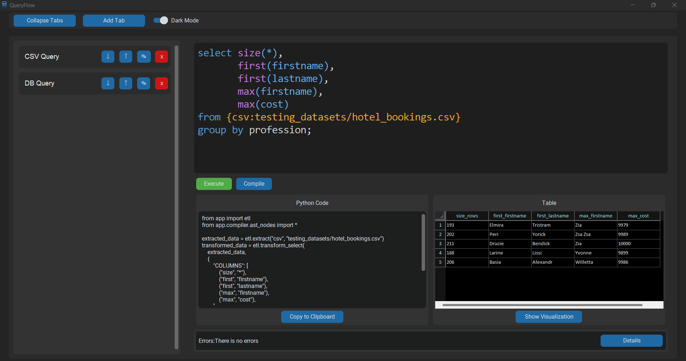
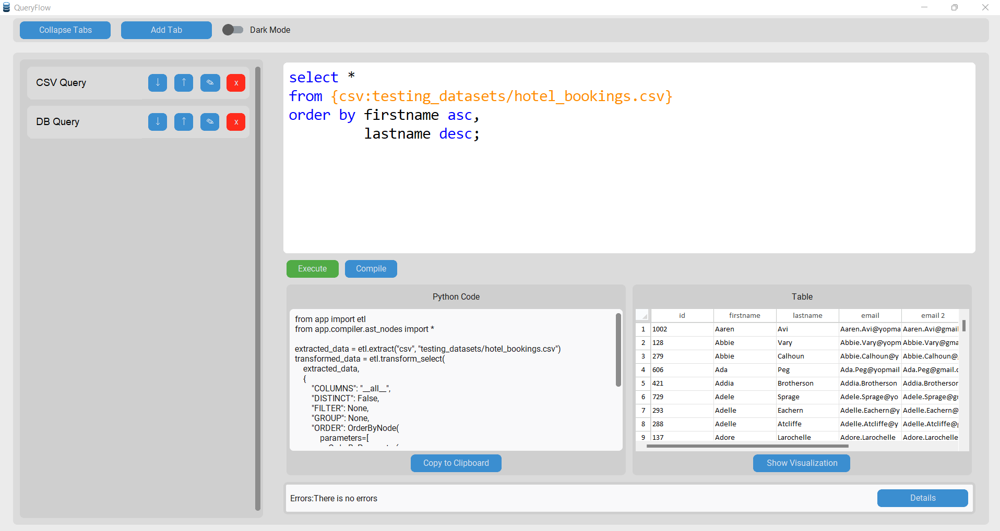
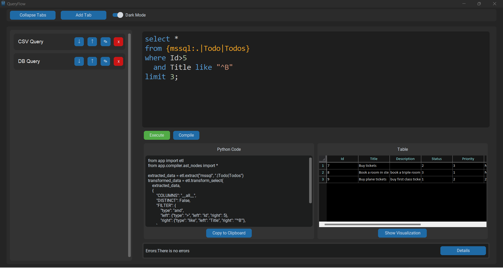
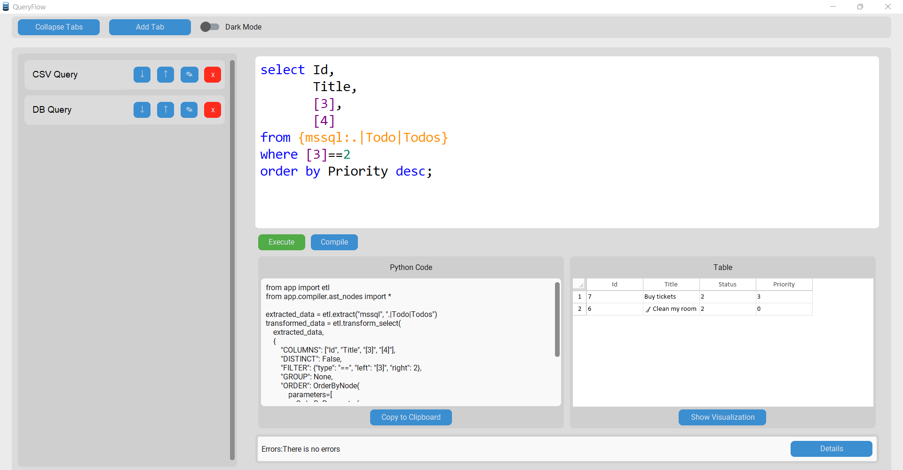
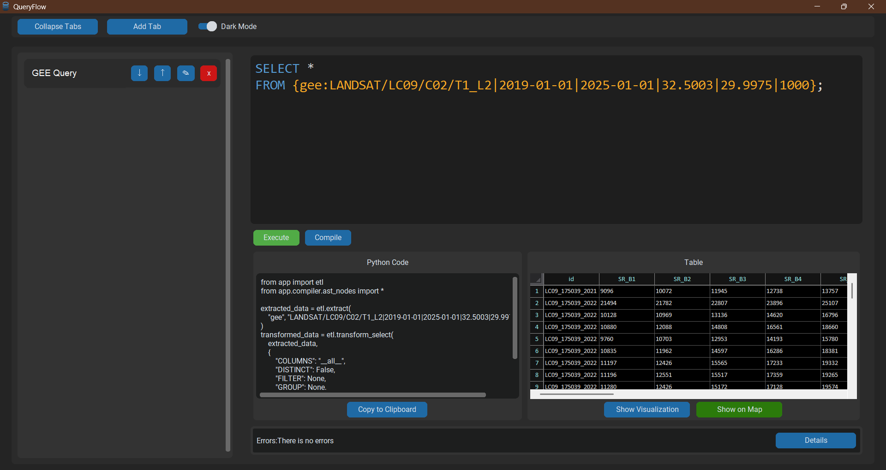
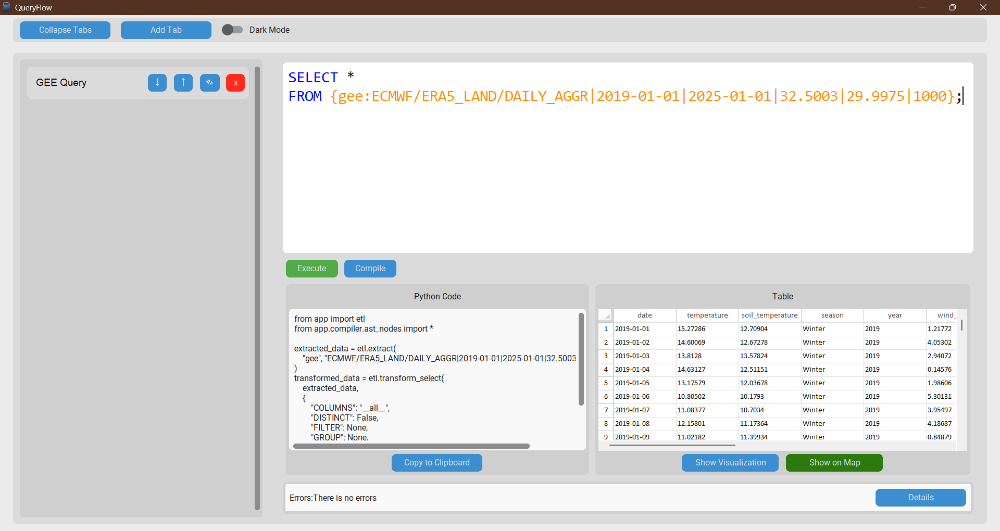
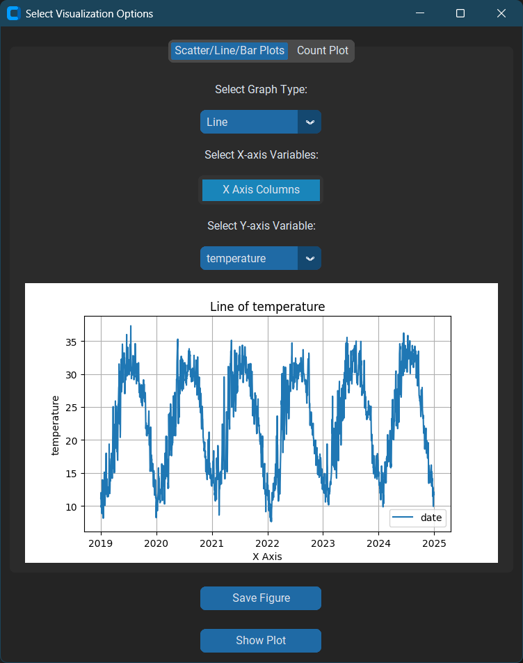
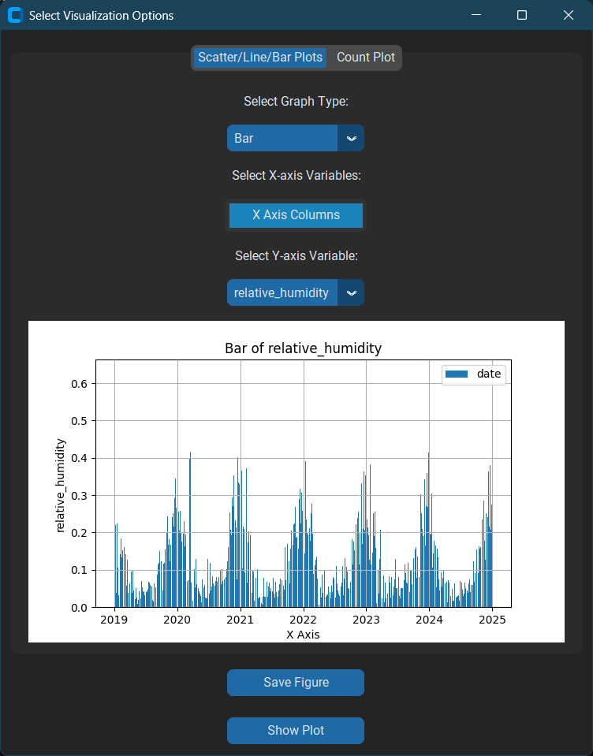

<p align="center">
    
</p>
<p align="center">
  <a href="https://github.com/hussiensharaf/A-CFG-Dynamic-Engine-for-dynamic-DSL-code-generation/blob/fix/optimization/LICENSE"></a>
	
	
	
</p>
<p align="center"><!-- default option, no dependency badges. -->
</p>
<p align="center">
	<!-- default option, no dependency badges. -->
</p>
<br>

## Table of Contents

- [ Overview](#overview)
- [ Features](#features)
- [ Built With](#built-with)
- [ Project Structure](#project-structure)
  - [ Project Index](#project-index)
- [ Getting Started](#getting-started)
  - [ Prerequisites](#prerequisites)
  - [ Installation](#installation)
  - [ Usage](#usage)
- [ License](#license)

---

## Overview

**_A CFG Dynamic Engine for DSL code generation_** It is a lightweight and user-friendly transpiler designed to simplify working with data.
It helps users manage, execute, and visualize queries efficiently, making it easier to gain insights from various data sources using SQL Syntax.

Abstract.
Purpose – This research introduces a novel ETL engine designed to streamline and unify data integration processes. By employing a declarative SQL-like language, the engine empowers users to express complex data transformations without the need for intricate procedural coding. The engine dynamically generates domain-specific logic (DSL) in Python code based on user-defined queries, ensuring efficient data extraction, transformation, and loading from diverse sources. The proposed engine interface inherits the simplicity of the SQL and Language-integrated query (LINQ) frameworks. It provides a powerful abstraction for processing in-memory data collections, enabling developers to express queries declaratively. Given the widespread popularity of large language models (LLMs), but they may not be trained using specific vocabulary, which leads to unsatisfactory results. Therefore, data scientists still need to generate code according to Domain-Specific Logic (DSL). (Abejide Ade-Ibijola and George Obaido. 2017) The use of CFG (context free grammar) as a core module in the engine facilitates easy customization and integration with various ETL tools and libraries. More importantly, the engine's reliance on CFG provides a powerful mechanism for programmers to incorporate domain-specific logic and extend the engine's functionality to address unique data processing challenges.

Methodology – The proposed engine encompasses a dynamic core that can be extended or modified at runtime. It borrows some concepts from the automata theory and tools of compilers construction. CFG production rules are embedded as a loosely coupled module in the core of the engine. It uses the famous compilers’ tools LEX and YAAC for scanning and parsing a given query using CFG rules.

Findings – Benchmark results demonstrate the engine's superior performance compared to existing ETL solutions, particularly when handling various data formats. The SQL-like interface provides a consistent programming paradigm for data engineers, fostering easier adoption and increased productivity. The engine's ability to handle large-scale datasets and complex transformations makes it well-suited for demanding data integration scenarios. Moreover, Benchmarking of PETL and Panadas libraries show that operations against CSV, SQLite and JSON are relatively faster than the famous relational database management system; MS-SQL Server. Interestingly in contrast to other data-sources, JSON takes more time for reading than time for writing operations, due to its recursive nature. Generally, Pandas proved superior to PETL in performance.

Originality/value – Programmers and experienced data engineers can extend and modify the ETL functionalities and specify customized behavior at runtime by modifying the CFG based core of the engine. More data sources can easily be integrated.

Keywords Dynamic, Python, code generation, ETL, In-memory data collections, compilers, LINQ, CFG , LEX, YAAC, modular architecture, DSL, LLMs, benchmarks.

---

## Features

- **Data Manipulation**: Using SQL Select operation

  - **Local**:
    - **Databases**:
      - **SQLite**
      - **MSSQL**
    - **Flat Files**:
      - **CSV**
      - **JSON**
      - **XML**
      - **Excel**
      - **HTML**
  - **Remote**:
    - **Google Earth Engine (GEE)**

- **GUI**:
  - **Themes**:
    - **Dark Mode**
    - **Light Mode**
  - **Tabs**: Can be used to navigate between different Queries written by the user.
    - **Content**:
      - **SQL Text Box**: A text box for writing SQL queries.
        - **Highlighting & formatting**: Syntax highlighting and formatting for the written SQL queries.
      - **Python Code Text Box**:Displaying the Translated written SQL query into Python code and the user can edit the generated Python code.
      - **Table View**: Shows the result of the query in a tabular format.
- **Visualization**: Using Pandas, Matplotlib and Seaborn to visualize data.

---

## Built With

- **CustomTkinter**: For creating a modern and responsive user interface.
- **Ply**: For parsing and interpreting query syntax.
- **TkSheet**: For displaying tabular data in an interactive spreadsheet format.
- **Pandas**: For data manipulation and analysis.
- **SQLAlchemy**: For database interaction and management.
- **sqlparse**: For parsing and formatting SQL queries.
- **Google Earth Engine (GEE)**: For integrating geospatial data analysis capabilities.

---

## Gallery

### CSV Example 1



### CSV Example 2



### DB Example 1



### DB Example 2



### GEE Example 1



### GEE Example 2



### Line Plot Visualization Example



### Scatter Plot Visualization Example


### Bar Plot Visualization Example



### Map Visualization Example


---

## Project Structure

```sh
└── QueryFlow/
    ├── LICENSE
    ├── app
    │   ├── __init__.py
    │   ├── compiler
    │   ├── core
    │   ├── cv
    │   ├── etl
    │   ├── gui
    │   └── utility.py
    ├── main.py
    ├── requirements.txt
    └── testing_datasets
        └── hotel_bookings.csv
```

### Project Index

<details open>
	<summary><b><code>QueryFlow/</code></b></summary>
	<details> <!-- __root__ Submodule -->
		<summary><b>__root__</b></summary>
		<blockquote>
			<table>
			<tr>
				<td><b><a href='https://github.com/hussiensharaf/A-CFG-Dynamic-Engine-for-dynamic-DSL-code-generation/blob/master/main.py'>main.py</a></b></td>
			</tr>
			<tr>
				<td><b><a href='https://github.com/hussiensharaf/A-CFG-Dynamic-Engine-for-dynamic-DSL-code-generation/blob/master/requirements.txt'>requirements.txt</a></b></td>
			</tr>
			</table>
		</blockquote>
	</details>
	<details> <!-- app Submodule -->
		<summary><b>app</b></summary>
		<blockquote>
			<table>
			<tr>
				<td><b><a href='https://github.com/hussiensharaf/A-CFG-Dynamic-Engine-for-dynamic-DSL-code-generation/blob/master/app/utility.py'>utility.py</a></b></td>
			</tr>
			</table>
			<details>
				<summary><b>core</b></summary>
				<blockquote>
					<table>
					<tr>
						<td><b><a href='https://github.com/hussiensharaf/A-CFG-Dynamic-Engine-for-dynamic-DSL-code-generation/blob/master/app/core/errors.py'>errors.py</a></b></td>
					</tr>
					<tr>
						<td><b><a href='https://github.com/hussiensharaf/A-CFG-Dynamic-Engine-for-dynamic-DSL-code-generation/blob/master/app/core/result_monad.py'>result_monad.py</a></b></td>
					</tr>
					</table>
				</blockquote>
			</details>
			<details>
				<summary><b>etl</b></summary>
				<blockquote>
					<table>
					<tr>
						<td><b><a href='https://github.com/hussiensharaf/A-CFG-Dynamic-Engine-for-dynamic-DSL-code-generation/blob/master/app/etl/controllers.py'>controllers.py</a></b></td>
					</tr>
					<tr>
						<td><b><a href='https://github.com/hussiensharaf/A-CFG-Dynamic-Engine-for-dynamic-DSL-code-generation/blob/master/app/etl/helpers.py'>helpers.py</a></b></td>
					</tr>
					<tr>
						<td><b><a href='https://github.com/hussiensharaf/A-CFG-Dynamic-Engine-for-dynamic-DSL-code-generation/blob/master/app/etl/core.py'>core.py</a></b></td>
					</tr>
					</table>
				</blockquote>
			</details>
			<details>
				<summary><b>cv</b></summary>
				<blockquote>
					<table>
					<tr>
						<td><b><a href='https://github.com/hussiensharaf/A-CFG-Dynamic-Engine-for-dynamic-DSL-code-generation/blob/master/app/cv/video_reader.py'>video_reader.py</a></b></td>
					</tr>
					<tr>
						<td><b><a href='https://github.com/hussiensharaf/A-CFG-Dynamic-Engine-for-dynamic-DSL-code-generation/blob/master/app/cv/details_extractor.py'>details_extractor.py</a></b></td>
					</tr>
					<tr>
						<td><b><a href='https://github.com/hussiensharaf/A-CFG-Dynamic-Engine-for-dynamic-DSL-code-generation/blob/master/app/cv/detector.py'>detector.py</a></b></td>
					</tr>
					<tr>
						<td><b><a href='https://github.com/hussiensharaf/A-CFG-Dynamic-Engine-for-dynamic-DSL-code-generation/blob/master/app/cv/operation_main.py'>operation_main.py</a></b></td>
					</tr>
					<tr>
						<td><b><a href='https://github.com/hussiensharaf/A-CFG-Dynamic-Engine-for-dynamic-DSL-code-generation/blob/master/app/cv/threading_main.py'>threading_main.py</a></b></td>
					</tr>
					<tr>
						<td><b><a href='https://github.com/hussiensharaf/A-CFG-Dynamic-Engine-for-dynamic-DSL-code-generation/blob/master/app/cv/bird_move.py'>bird_move.py</a></b></td>
					</tr>
					<tr>
						<td><b><a href='https://github.com/hussiensharaf/A-CFG-Dynamic-Engine-for-dynamic-DSL-code-generation/blob/master/app/cv/bird.py'>bird.py</a></b></td>
					</tr>
					<tr>
						<td><b><a href='https://github.com/hussiensharaf/A-CFG-Dynamic-Engine-for-dynamic-DSL-code-generation/blob/master/app/cv/folder_reader.py'>folder_reader.py</a></b></td>
					</tr>
					</table>
				</blockquote>
			</details>
			<details>
				<summary><b>gui</b></summary>
				<blockquote>
					<table>
					<tr>
						<td><b><a href='https://github.com/hussiensharaf/A-CFG-Dynamic-Engine-for-dynamic-DSL-code-generation/blob/master/app/gui/ui_compiler.py'>ui_compiler.py</a></b></td>
					</tr>
					</table>
					<details>
						<summary><b>error_frame</b></summary>
						<blockquote>
							<table>
							<tr>
								<td><b><a href='https://github.com/hussiensharaf/A-CFG-Dynamic-Engine-for-dynamic-DSL-code-generation/blob/master/app/gui/error_frame/error_details_popup.py'>error_details_popup.py</a></b></td>
							</tr>
							<tr>
								<td><b><a href='https://github.com/hussiensharaf/A-CFG-Dynamic-Engine-for-dynamic-DSL-code-generation/blob/master/app/gui/error_frame/error_frame.py'>error_frame.py</a></b></td>
							</tr>
							</table>
						</blockquote>
					</details>
					<details>
						<summary><b>results_frame</b></summary>
						<blockquote>
							<table>
							<tr>
								<td><b><a href='https://github.com/hussiensharaf/A-CFG-Dynamic-Engine-for-dynamic-DSL-code-generation/blob/master/app/gui/results_frame/python_frame.py'>python_frame.py</a></b></td>
							</tr>
							<tr>
								<td><b><a href='https://github.com/hussiensharaf/A-CFG-Dynamic-Engine-for-dynamic-DSL-code-generation/blob/master/app/gui/results_frame/results_frame.py'>results_frame.py</a></b></td>
							</tr>
							</table>
							<details>
								<summary><b>table_result_frame</b></summary>
								<blockquote>
									<table>
									<tr>
										<td><b><a href='https://github.com/hussiensharaf/A-CFG-Dynamic-Engine-for-dynamic-DSL-code-generation/blob/master/app/gui/results_frame/table_result_frame/visualization.py'>visualization.py</a></b></td>
									</tr>
									<tr>
										<td><b><a href='https://github.com/hussiensharaf/A-CFG-Dynamic-Engine-for-dynamic-DSL-code-generation/blob/master/app/gui/results_frame/table_result_frame/table_widget.py'>table_widget.py</a></b></td>
									</tr>
									<tr>
										<td><b><a href='https://github.com/hussiensharaf/A-CFG-Dynamic-Engine-for-dynamic-DSL-code-generation/blob/master/app/gui/results_frame/table_result_frame/table_frame.py'>table_frame.py</a></b></td>
									</tr>
									<tr>
										<td><b><a href='https://github.com/hussiensharaf/A-CFG-Dynamic-Engine-for-dynamic-DSL-code-generation/blob/master/app/gui/results_frame/table_result_frame/multi_selection_dropdown.py'>multi_selection_dropdown.py</a></b></td>
									</tr>
									</table>
								</blockquote>
							</details>
						</blockquote>
					</details>
					<details>
						<summary><b>vertical_tab_view</b></summary>
						<blockquote>
							<table>
							<tr>
								<td><b><a href='https://github.com/hussiensharaf/A-CFG-Dynamic-Engine-for-dynamic-DSL-code-generation/blob/master/app/gui/vertical_tab_view/tab_button.py'>tab_button.py</a></b></td>
							</tr>
							<tr>
								<td><b><a href='https://github.com/hussiensharaf/A-CFG-Dynamic-Engine-for-dynamic-DSL-code-generation/blob/master/app/gui/vertical_tab_view/vertical_tab_view.py'>vertical_tab_view.py</a></b></td>
							</tr>
							<tr>
								<td><b><a href='https://github.com/hussiensharaf/A-CFG-Dynamic-Engine-for-dynamic-DSL-code-generation/blob/master/app/gui/vertical_tab_view/content_frame.py'>content_frame.py</a></b></td>
							</tr>
							<tr>
								<td><b><a href='https://github.com/hussiensharaf/A-CFG-Dynamic-Engine-for-dynamic-DSL-code-generation/blob/master/app/gui/vertical_tab_view/sql_textbox_colorizer.py'>sql_textbox_colorizer.py</a></b></td>
							</tr>
							</table>
						</blockquote>
					</details>
				</blockquote>
			</details>
			<details>
				<summary><b>compiler</b></summary>
				<blockquote>
					<table>
					<tr>
						<td><b><a href='https://github.com/hussiensharaf/A-CFG-Dynamic-Engine-for-dynamic-DSL-code-generation/blob/master/app/compiler/lex.py'>lex.py</a></b></td>
					</tr>
					<tr>
						<td><b><a href='https://github.com/hussiensharaf/A-CFG-Dynamic-Engine-for-dynamic-DSL-code-generation/blob/master/app/compiler/yacc.py'>yacc.py</a></b></td>
					</tr>
					<tr>
						<td><b><a href='https://github.com/hussiensharaf/A-CFG-Dynamic-Engine-for-dynamic-DSL-code-generation/blob/master/app/compiler/ast_nodes.py'>ast_nodes.py</a></b></td>
					</tr>
					</table>
				</blockquote>
			</details>
		</blockquote>
	</details>
</details>

---

## Getting Started

### Prerequisites

Before getting started with QueryFlow, ensure your runtime environment meets the following requirements:

- **Programming Language:** Python 3.12

### Installation

**From source:**

1. Clone the QueryFlow repository:

```sh
❯ git clone https://github.com/hussiensharaf/A-CFG-Dynamic-Engine-for-dynamic-DSL-code-generation
```

2. Navigate to the project directory:

```sh
❯ cd QueryFlow
```

3. Install the project dependencies:

**Using `pip`** &nbsp; [](https://pypi.org/project/pip/)

```sh
❯ pip install -r requirements.txt
```

### Usage

Run QueryFlow using the following command:
**Using `pip`** &nbsp; [](https://pypi.org/project/pip/)

```sh
❯ python main.py
```

---

## License

This project is protected under the **_MIT_** License. For more details, refer to the [LICENSE](LICENSE) file.

---
